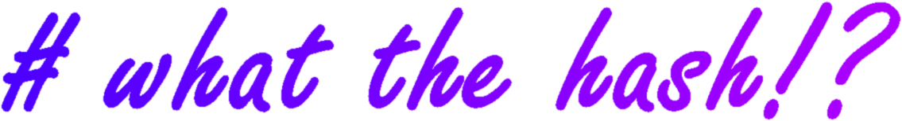

Have you ever stumpled upon a hash and didn't know what for? Me too, buddy. So I created this simple program one Saturday evening, that we might wonder no more!

**What the hash** is an utterly simple console program written in Go. It consists of a database of [150](https://github.com/s0md3v/Bolt/blob/master/db/hashes.json) different hash algorithms and prints out all possibly matching ones in [hashcat](https://hashcat.net/hashcat/) notation. 

```sh
$ wth HASH
```

## License
Released under the [MIT License](LICENSE).